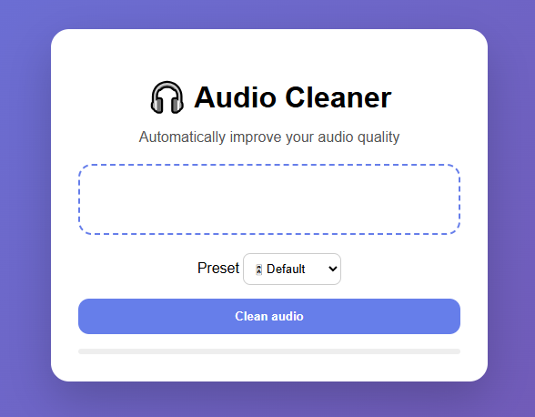

# 🎵 Audio Cleaner

Welcome to **Audio Cleaner**, your online tool to instantly enhance audio quality.  
Clean up recordings with just a few clicks—no technical skills required!  



---

## ✨ Features

- 🎶 **Quick Audio Cleaning** – Remove background noise and improve clarity in seconds.  
- 🗂️ **Multi-format Support** – Works with MP3 and WAV files.  
- ⚙️ **Customizable Presets** – Choose the cleaning preset that fits your needs.  
- 💻 **Modern UI** – Startup-style, responsive, and intuitive design.  
- 🖱️ **Drag & Drop** – Simply drag your files into the browser to clean them instantly.  

---

## 🚀 How to Use

1. Visit the web app: [**Audio Cleaner Online**](https://audio-cleaner-oneclick.vercel.app/)  
2. Upload or drag your audio file.  
3. Select the desired preset and click **Clean**.  
4. Download your cleaned audio and enjoy!  

---

## 💻 Tech Stack

- **Backend:** FastAPI (Python)  
- **Frontend:** HTML5, CSS3, JavaScript  
- **Audio Processing:** Python audio libraries  
- **Deployment:** Vercel  

---

## 📂 Project Structure

```text
audio-cleaner/
│
├─ backend/          # Audio processing logic
├─ frontend/         # Web interface
├─ assets/
│   └─ audio-cleaner.png
├─ README.md
└─ requirements.txt  # Project dependencies
